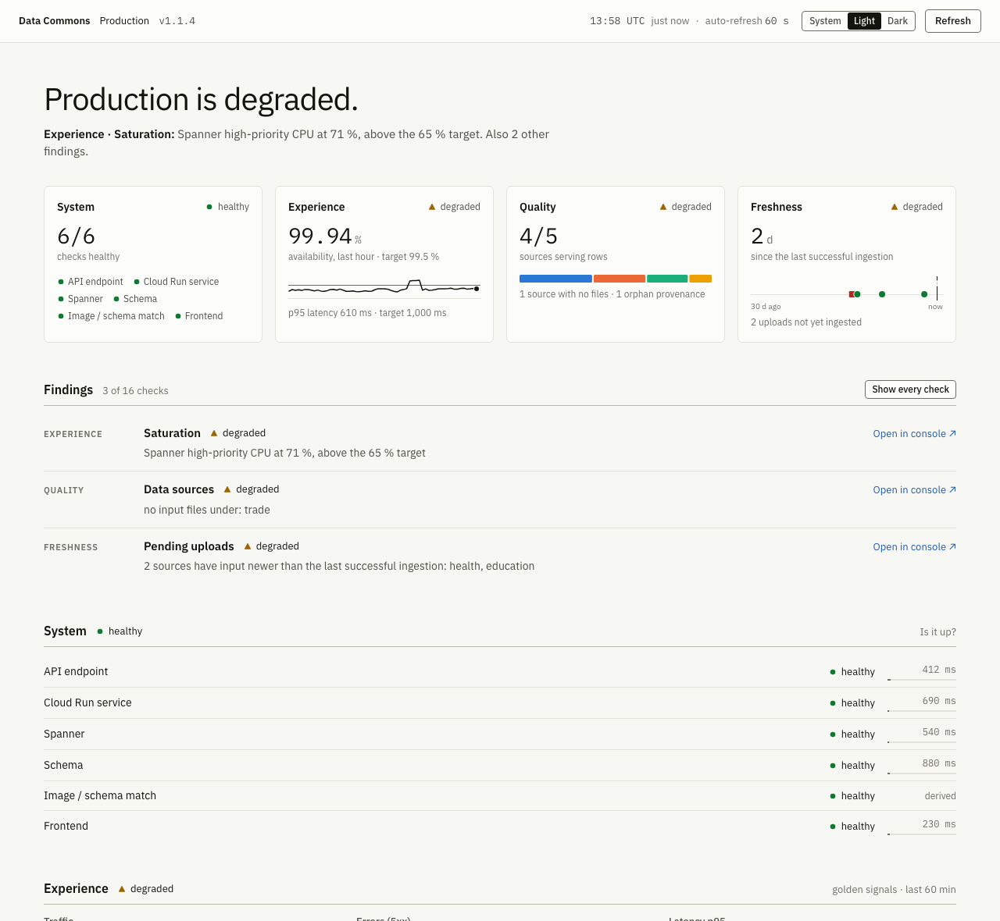
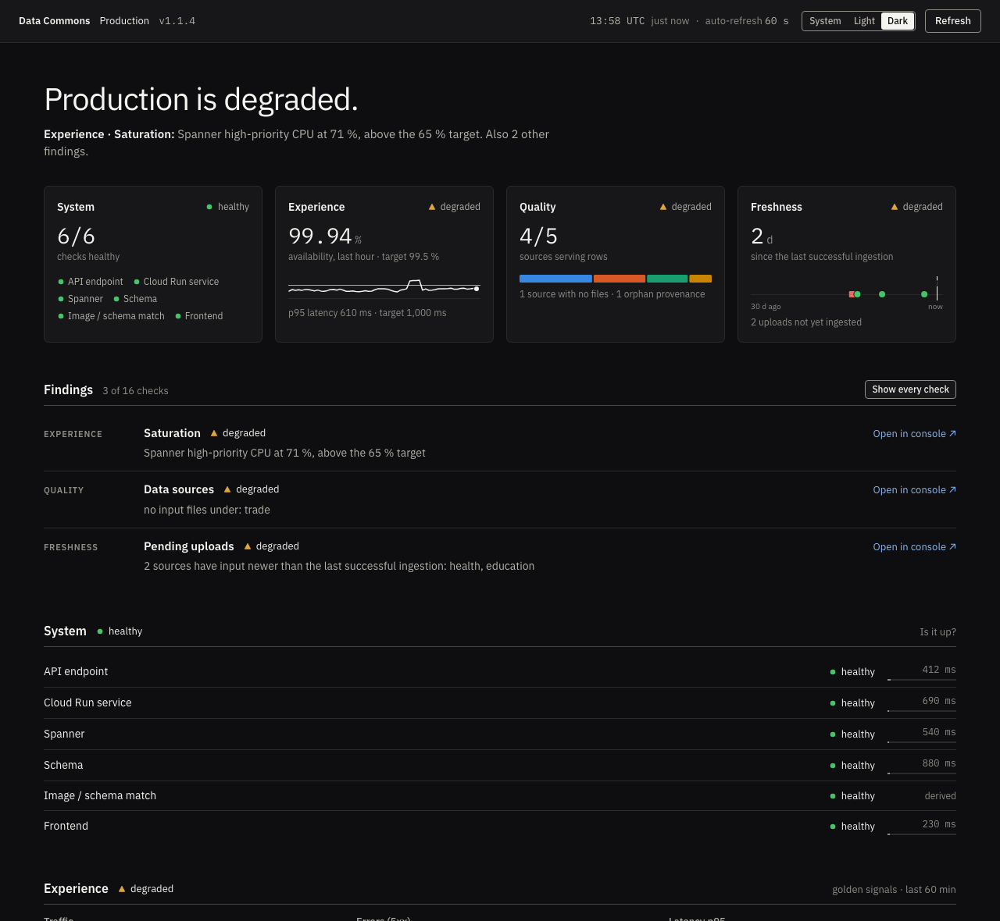

# Data Commons Status Panel

[](https://github.com/carlosinfantes/datacommons-status-panel/actions/workflows/ci.yml)
[](https://scorecard.dev/viewer/?uri=github.com/carlosinfantes/datacommons-status-panel)

A single page, deployed next to a [Data Commons Platform](https://datacommons.org)
(DCP) instance, that tells its operator whether the deployment is up, serving
users well, holding complete data and holding current data. It is for teams
running their own [custom Data Commons](https://docs.datacommons.org/custom_dc/)
on Google Cloud.

| Light | Dark |
|---|---|
|  |  |

One panel serves one deployment. It runs on Cloud Run behind Identity-Aware
Proxy, reads the platform's own resources with read-only roles, and stores
nothing.

## What it answers

The page opens with a verdict, one sentence naming the worst state and its
cause, and four tiles, one per dimension. A dimension's state is the worst of
its probes; the verdict is the worst dimension.

| Dimension | Question | Probes |
|---|---|---|
| System | Is it up? | `dc_api` resolves a canary node through the public API · `dc_service` Cloud Run latest revision ready · `spanner` instance and database `READY` · `schema` required tables present · `version_consistency` image not newer than the schema · `frontend` answers 200 |
| Experience | Are users served well? | Golden signals from Cloud Monitoring over the last `signals_window_minutes`: `errors` (availability) · `latency` (p50/p95/p99) · `saturation` (Cloud Run CPU, memory and instances; Spanner high-priority CPU) |
| Quality | Is the data complete? | `counts` rows per table · `data_sources` input files per source crossed with rows served · `import_status` failed or retrying imports · `row_drift` row drop between the last two successful ingestions |
| Freshness | Is the data current? | `ingestions` last runs with their workflow executions · `ingestion_lock` lock held with no workflow running · `pending_uploads` input newer than the last successful ingestion |

Every probe links to the most specific Cloud Console page for what it checked.
The full probe table, with the exact condition for each state, is in the
[design document](docs/design/2026-09-28-status-panel-v1-design.md#probes).

Errors and latency are shown but not judged while traffic is below
`min_requests_per_hour`, so a quiet deployment does not flap. Targets travel
inside the document: the page draws the target the collector judged against,
never one of its own.

## Quickstart

Prerequisites: a running DCP deployment on Spanner, the IAP and Artifact
Registry APIs enabled in its project, and an OAuth consent screen
(`google_iap_brand`) in that project. This module does not create the consent
screen; without one the first `apply` fails.

The principal that runs `terraform apply` needs, beyond creating the resources:

- `artifactregistry.repositories.downloadArtifacts` on the image's repository.
  Cloud Run checks that whoever deploys a revision can read its image.
- `iam.serviceAccounts.actAs` on the collector's service account. If you grant
  `actAs` per service account rather than project-wide, create the account and
  that binding yourself, before the module, and pass `create_service_account = false`
  with `service_account_email`.

**1. Get the image.** Each release publishes
`ghcr.io/carlosinfantes/dc-status:<version>` signed with cosign, with SLSA
provenance and an SBOM. The release notes give the digest. Verify it (see
[Verifying the image](#verifying-the-image)) before deploying. To build your own
instead:

```bash
cd collector
IMAGE=<REGION>-docker.pkg.dev/<PROJECT>/<REPO>/dc-status
gcloud builds submit . --tag "$IMAGE:<version>" --project=<PROJECT>
gcloud artifacts docker images describe "$IMAGE:<version>" \
  --project=<PROJECT> --format="value(image_summary.digest)"
```

**2. Pin it by digest.** Cloud Run cannot pull from `ghcr.io`. Set
`create_ghcr_remote = true` and the module creates an Artifact Registry remote
repository with GHCR upstream; its `ghcr_remote_image` output is the path to use.
The path is deterministic, so it can be written before the first apply:

```
<REGION>-docker.pkg.dev/<PROJECT>/<INSTANCE_NAME>-ghcr/carlosinfantes/dc-status:<version>@sha256:<digest>
```

The module rejects an `image` without `@sha256:`. A tag can move under an
unchanged plan; a digest cannot.

**3. Add the module.**

```hcl
module "status_panel" {
  source = "github.com/carlosinfantes/datacommons-status-panel//infra/dcp/modules/status_panel?ref=v1.0.0"

  project_id    = var.project_id
  region        = var.region
  instance_name = "prod"

  create_ghcr_remote = true
  image              = "us-central1-docker.pkg.dev/my-project/prod-ghcr/carlosinfantes/dc-status:1.0.0@sha256:<digest>"

  env_id                   = "prod"
  env_label                = "Production"
  spanner_instance_id      = "<instance>"
  spanner_database_id      = "<database>"
  datacommons_service_name = "<datacommons-cloud-run-service>"
  ingestion_workflow_name  = "<ingestion-workflow>"
  artifacts_bucket_name    = "<bucket>"
  public_endpoint_url      = "https://api.example.org"
  frontend_url             = "https://www.example.org"
  data_source_prefixes     = ["agency-a", "agency-b"]

  iap_members  = ["group:dc-admins@example.org"]
  iap_audience = "<read after the first deploy, see below>"

  # Optional. Unset fields keep their defaults.
  targets = { latency_p95_ms = 800, ingestion_max_age_hours = 48 }
  canary  = { node = "country/FRA", name = "France" }
}
```

Grant a group rather than individuals, so joining and leaving is not a
`terraform apply`. With `iap_members` empty nobody can get in.

`iap_audience` is the `aud` claim of the IAP assertions for this service. The
module does not guess it, because the format differs between IAP on a load
balancer and IAP enabled natively on Cloud Run. It is required while
`require_auth` is on (the default), and a wrong value fails closed. Apply once
with a placeholder, open the panel, and read the 403 reason from the service's
logs: the collector logs why it refused each request, and an audience mismatch
names the audience the assertion carried. Pin that value and apply again.

**4. Apply.** `terraform plan` checks every variable, including target ranges,
the digest pin and the `require_auth`/`iap_audience` pairing, with no GCP
credentials, so CI catches a bad configuration.

**5. Open the URL** from the `service_uri` output. Signing in goes through IAP.

## Configuration reference

The collector reads its configuration from environment variables, all prefixed
`DCS_`, and validates them at start-up: a missing required variable, a
percentage outside 0–100 or a negative duration or count stops it with a
`ConfigError` naming the variable. The Terraform module sets each one from the
variable shown, and validates the same ranges at plan time.

### Deployment (required)

| Variable | Terraform | Meaning |
|---|---|---|
| `DCS_ENV_ID` | `env_id` | Short identifier shown on the page. |
| `DCS_PROJECT_ID` | `project_id` | Project hosting the deployment. |
| `DCS_REGION` | `region` | Region of the Cloud Run services. |
| `DCS_SPANNER_INSTANCE_ID` | `spanner_instance_id` | Spanner instance the platform serves from. |
| `DCS_SPANNER_DATABASE_ID` | `spanner_database_id` | Spanner database the platform serves from. |
| `DCS_DATACOMMONS_SERVICE_NAME` | `datacommons_service_name` | Data Commons Cloud Run service. |
| `DCS_INGESTION_WORKFLOW_NAME` | `ingestion_workflow_name` | Ingestion workflow. |
| `DCS_ARTIFACTS_BUCKET_NAME` | `artifacts_bucket_name` | Bucket holding ingestion input. |
| `DCS_PUBLIC_ENDPOINT_URL` | `public_endpoint_url` | Public base URL of the API. |
| `DCS_FRONTEND_URL` | `frontend_url` | Public base URL of the frontend. |

### Deployment (optional)

| Variable | Terraform | Default | Meaning |
|---|---|---|---|
| `DCS_ENV_LABEL` | `env_label` | `DCS_ENV_ID` | Human-readable name. |
| `DCS_DATA_SOURCE_PREFIXES` | `data_source_prefixes` | empty | Comma-separated prefixes under the input path, one per source. |
| `DCS_INPUT_PREFIX` | `input_prefix` | `ingestion/input/` | Path in the bucket where per-source input lives. |
| `DCS_COUNTS_CACHE_TTL_SECONDS` | `counts_cache_ttl_seconds` | `300` | In-process cache for row counts. |
| `DCS_SCHEMA_CACHE_TTL_SECONDS` | `schema_cache_ttl_seconds` | `3600` | In-process cache for the discovered schema. |

### Probes and targets

| Variable | Terraform | Default | Meaning |
|---|---|---|---|
| `DCS_CANARY_NODE` | `canary.node` | `country/GTM` | Node `dc_api` resolves. Pick one your deployment serves. |
| `DCS_CANARY_NAME` | `canary.name` | `Guatemala` | Name that node must resolve to. |
| `DCS_SIGNALS_WINDOW_MINUTES` | `signals_window_minutes` | `60` | Window for the golden signals, one point per minute. 5–1440. |
| `DCS_TARGET_AVAILABILITY_PCT` | `targets.availability_pct` | `99.5` | Minimum availability, 1 − 5xx/total. |
| `DCS_TARGET_LATENCY_P95_MS` | `targets.latency_p95_ms` | `1000` | Maximum p95 latency. |
| `DCS_TARGET_RUN_CPU_PCT` | `targets.run_cpu_pct` | `80` | Cloud Run CPU utilisation limit. |
| `DCS_TARGET_RUN_MEMORY_PCT` | `targets.run_memory_pct` | `80` | Cloud Run memory utilisation limit. |
| `DCS_TARGET_SPANNER_CPU_PCT` | `targets.spanner_cpu_pct` | `65` | Spanner high-priority CPU limit. 65 is Google's recommendation for regional instances; use 45 for multi-region. |
| `DCS_TARGET_MIN_REQUESTS_PER_HOUR` | `targets.min_requests_per_hour` | `100` | Below this, errors and latency are shown but not judged. |
| `DCS_TARGET_INGESTION_MAX_AGE_HOURS` | `targets.ingestion_max_age_hours` | unset | Maximum age of the last successful ingestion. Unset (Terraform `null`) shows the age without judging it. |
| `DCS_TARGET_MAX_ROW_DROP_PCT` | `targets.max_row_drop_pct` | `10` | Largest acceptable drop in a row count between ingestions. |

### Access

| Variable | Terraform | Default | Meaning |
|---|---|---|---|
| `DCS_REQUIRE_AUTH` | `require_auth` | `true` | Verify every request in the collector, on top of IAP. |
| `DCS_IAP_AUDIENCE` | `iap_audience` | empty | Expected `aud` of IAP assertions. Required when `DCS_REQUIRE_AUTH` is on. |

### Development only

The module never sets these.

| Variable | Meaning |
|---|---|
| `DCS_REPLAY_FILE` | Serve this JSON document instead of probing anything. |
| `DCS_REPLAY_SHIFT_TIME` | Shift the replayed document's timestamps so it reads as generated now. |

### Terraform-only variables

| Variable | Default | Meaning |
|---|---|---|
| `image` | none | Collector image. Must contain `@sha256:`. |
| `instance_name` | empty | Prefix for every resource name. |
| `enable_iap` | `true` | Native IAP on the Cloud Run service. Set `false` only when IAP runs on a load balancer you manage; `iap_members` is then not applied. |
| `iap_members` | `[]` | Principals granted `roles/iap.httpsResourceAccessor`. `allUsers` and `allAuthenticatedUsers` are rejected. |
| `create_ghcr_remote` | `false` | Create an Artifact Registry remote repository with `https://ghcr.io` upstream. |
| `ghcr_remote_repository_id` | `<instance_name>-ghcr` | ID of that repository (`ghcr` when `instance_name` is empty). |
| `ghcr_image_path` | `carlosinfantes/dc-status` | Image path on GHCR, for forks. |
| `vpc_access` | none | VPC egress: `{ connector = "projects/…/connectors/…" }` or `{ network, subnetwork }`, with `egress` (`PRIVATE_RANGES_ONLY` by default). Needed where `constraints/run.allowedVPCEgress` is enforced. |
| `create_service_account` | `true` | Set `false` to bring your own account (with `service_account_email`), e.g. when your deployer gets `actAs` per service account (see below). |
| `service_account_email` | none | The existing account the collector runs as when `create_service_account` is `false`. |
| `cpu`, `memory` | `1`, `512Mi` | Container limits. |
| `min_instances`, `max_instances` | `0`, `2` | Scaling. Zero minimum instances costs nothing at rest. |
| `max_request_concurrency` | `16` | Matches gunicorn's 2 workers × 8 threads. |
| `request_timeout_seconds` | `120` | Cloud Run request timeout. |
| `ingress` | `INGRESS_TRAFFIC_ALL` | Cloud Run ingress. |
| `stateless_deletion_protection` | `false` | Deletion protection on the service. |

Outputs: `service_uri`, `service_name`, `service_account_email`,
`ghcr_remote_image`.

## Security model

The document names projects, buckets, tables, row counts and ingestion history:
a reconnaissance map of the platform. It is for administrators only, and access
is controlled in two layers.

**The perimeter is IAP, and it is the only way in.** The module enables IAP on
the service, never grants `allUsers`, and gives `roles/run.invoker` to exactly
one principal: IAP's service agent. A request that did not come through IAP
cannot reach the container. With `iap_members` empty nobody can get in, so the
default posture is closed and access is added deliberately. Earlier versions
had a second door for peer panels, reached with an ID token without IAP; v1
removes it.

**The collector is the backstop** (`dc_status/auth.py`). Every route except
`/healthz` requires an `X-Goog-IAP-JWT-Assertion` header that verifies against
IAP's key set, with issuer `https://cloud.google.com/iap` and audience
`DCS_IAP_AUDIENCE`. This covers the deployment that is not correct: IAP turned
off, an over-broad invoker binding, a copy of the service stood up by hand.
Anything else gets `403 {"error": "forbidden"}`. The reason goes to the logs,
never to the caller, so a probe cannot learn how close it got.

`/healthz` stays open because Cloud Run's startup and liveness probes do not
traverse IAP, and it says nothing beyond "the process is up".

Authorisation is deliberately not re-implemented in the collector. Once an
assertion verifies, IAP has already decided that the caller holds
`roles/iap.httpsResourceAccessor`; copying that list into an environment
variable would only let the two drift apart.

`DCS_REQUIRE_AUTH` defaults to on, and the collector refuses to start if it is
on with no audience configured: a panel nobody can reach is a misconfiguration,
and it should say so once rather than look like an access problem to every
administrator who tries. The module checks the same condition with a
cross-variable `validation` rather than a `lifecycle` precondition, so it fails
in `terraform plan` with no GCP credentials.

**The collector's own identity is read-only and scoped as tightly as each API
allows:**

| Role | Scope | Why |
|---|---|---|
| `roles/spanner.databaseReader` | database | Counts, schema, ingestion and import tables. |
| `roles/spanner.viewer` | instance | Instance and database state; `databaseReader` does not include it. |
| `roles/run.viewer` | Data Commons service | Revision state and running version. |
| `roles/storage.legacyBucketReader` | artifacts bucket | Lists input object names and sizes, without reading their contents. |
| `roles/workflows.viewer` | project | The provider has no per-workflow IAM resource. |
| `roles/monitoring.viewer` | project | Cloud Monitoring has no IAM below the project. |

**Responses** carry `Content-Security-Policy: default-src 'self';
frame-ancestors 'none'`, `Referrer-Policy: no-referrer` and
`X-Content-Type-Options: nosniff`; `/api/*` responses carry
`Cache-Control: no-store`. Fonts are bundled, so the page makes no third-party
request.

See [SECURITY.md](SECURITY.md) to report a vulnerability.

## Verifying the image

Release images are built by `.github/workflows/release.yml` on a `v*.*.*` tag,
signed with cosign keyless through the workflow's OIDC identity, and carry SLSA
build provenance and an SBOM.

Check the signature:

```bash
cosign verify ghcr.io/carlosinfantes/dc-status@sha256:<digest> \
  --certificate-identity-regexp 'https://github.com/carlosinfantes/datacommons-status-panel/' \
  --certificate-oidc-issuer https://token.actions.githubusercontent.com
```

Check the provenance attestation:

```bash
gh attestation verify oci://ghcr.io/carlosinfantes/dc-status@sha256:<digest> \
  --owner carlosinfantes
```

Read the SBOM:

```bash
docker buildx imagetools inspect ghcr.io/carlosinfantes/dc-status@sha256:<digest> \
  --format '{{ json .SBOM }}'
```

The image pulled through the Artifact Registry remote repository has the same
digest, so what you verified is what Cloud Run runs.

## Architecture

- **Collector.** A plain WSGI application under gunicorn (2 workers × 8
  threads), no framework. It serves the page, `/static/*`, `/healthz` and
  `GET /api/v1/status`.
- **REST only.** Every Google API, including Cloud Monitoring, is called over
  REST with `google-auth` and `requests`. The runtime dependencies are those two
  and `gunicorn`.
- **Probes** run concurrently under one shared 25 s deadline for the whole
  collection. Each reports its state, `elapsed_ms`, `budget_ms` and a Console
  link. A probe that cannot tell reports `unknown`, never `healthy`, and the
  document is then marked `partial`.
- **Golden signals** come from Cloud Monitoring: `run.googleapis.com`
  request count, request latencies, CPU and memory utilisation and instance
  count, and Spanner high-priority CPU, aligned to one point per minute over the
  configured window.
- **Cache.** The document is cached for 30 s and the cache is single-flight:
  concurrent requests share one collection. `?fresh=1` bypasses it, at most once
  every 10 s per instance.
- **Page.** Static HTML, CSS and JavaScript that render the document
  (`schema_version: 2`). The page derives nothing it has to judge: states and
  targets come from the collector.

## Running locally

```bash
cd collector
uv sync
uv run pytest
cp local.env.example local.env   # fill in your own project
uv run python -m dc_status.cli --env-file local.env
```

The CLI prints the document using your own application-default credentials.

To work on the page without credentials or a deployment, replay the canonical
example document, which contains no real names:

```bash
cd collector
set -a; . ./local.env; set +a
DCS_REQUIRE_AUTH=false \
DCS_REPLAY_FILE=tests/fixtures/demo.json \
DCS_REPLAY_SHIFT_TIME=true \
  uv run gunicorn --bind :8080 dc_status.app:application
```

`collector/tests/fixtures/demo.json` is also what the tests read and what the
screenshots above are taken from. The Terraform module never sets
`DCS_REPLAY_FILE`.

Checks CI runs are listed in [CONTRIBUTING.md](CONTRIBUTING.md).

## Design notes

The decisions behind v1 (D1–D11) and the full probe and document specification
are in the [design document](docs/design/2026-09-28-status-panel-v1-design.md).

### How long a check took, against how long it had

Each probe emits `budget_ms` alongside `elapsed_ms`, because a duration on its
own cannot say whether a check is comfortable or one second from being dropped.
The page draws the ratio as a hairline under the timing: quiet below half the
budget, warning above it, critical from 85%.

The budget is whichever deadline actually binds that probe, not one number for
all of them:

| Probe | Budget | Why |
|---|---|---|
| `dc_api`, `frontend` | 8 s | `PublicClient` timeout, no retries |
| `counts` | 20 s | the probe's own `budget_seconds` |
| everything else | 25 s | the shared collection deadline; their REST calls retry for up to 30 s, so the deadline is what gives up first |
| `version_consistency` | none (`0`) | derived from two other probes, does no I/O, never raced against a clock |

Reporting a flat 25 s would be worse than reporting nothing: a frontend check
dying at its own 8 s ceiling would render as a comfortable 32% of budget. A test
pins the table to the client constants so the two cannot drift apart.

### Judging

- A dimension is the worst of its probes and the verdict is the worst
  dimension, so the page answers the operator's four questions in the order they
  ask them.
- Low traffic is shown but not judged, below `min_requests_per_hour`.
- The failure that matters for versions is an image newer than the database it
  serves from, which `version_consistency` reports. A platform minor version the
  panel does not know yet is checked against the newest known table set, and the
  probe says so, so upgrading before the panel does not turn it red.

### Fonts

IBM Plex Sans (variable) and IBM Plex Mono ship inside the image as woff2 in
`dc_status/web/fonts/`, about 60 KB together, served from `/static/fonts/`. They
are bundled rather than fetched from a CDN because the page sits behind IAP and
must not depend on a third-party request. They are OFL-1.1; the notice is in
`dc_status/web/fonts/OFL.txt`, which ships in the wheel but is deliberately not a
route.

### Conventions the page does not break

- **State is never carried by colour alone.** Every state has a drawn glyph and
  a word.
- **Figures are set in the mono face**, hero figures included, so a number reads
  as a measurement before it is read.
- **Dark mode has its own chart steps**, validated against the dark surface
  rather than inverted. A System/Light/Dark switch is stored locally.
- **Every chart has a tooltip** on hover and keyboard focus, and an accessible
  text equivalent; the tables are the table view.

### Motion

One central definition per curve, `transform` and `opacity` only, everything
under 300 ms. `prefers-reduced-motion` drops movement and keeps the fade.

## License

Apache License 2.0; see [LICENSE](LICENSE). The bundled IBM Plex fonts are under
the SIL Open Font License 1.1.
